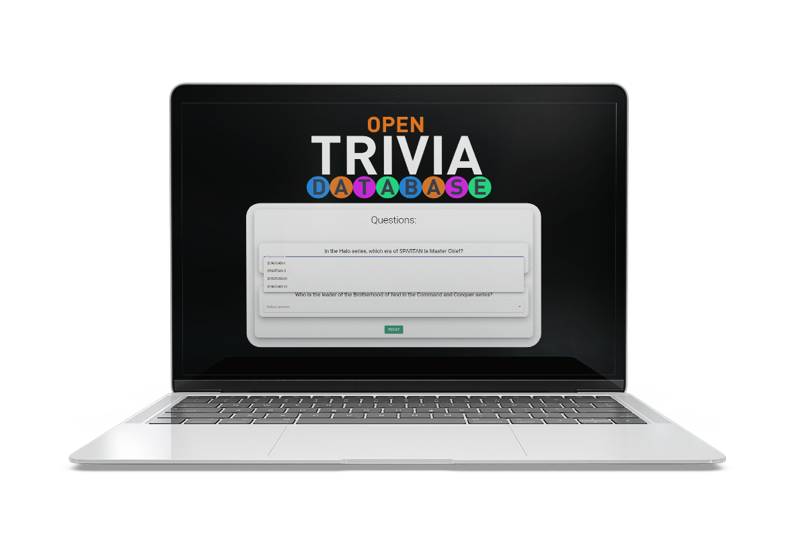

# React Quiz Application

> Simple Quiz Application using the [Open Trivia Database](https://opentdb.com/).
> Perfect example of using:

- [x] useEffect
- [x] useState
- [x] await / async
- [x] axios
- [x] MaterialUI

# Instructions

- clone repo
- run `yarn install`
- run `yarn run server` to start up the JSON Server
- run `yarn run start` to start up the frontend UI

<h1 align="center">

</h1>
